# Jarkom-Modul-1-2026-K-24

## Member

| Nama                      | NRP        |
| ------------------------- | ---------- |
| Wildan Alfarezy       | 5027251088 |
| Ashkhabil Abror Budihardjo | 5027251049 |

## Laporan

1. Untuk pembangunan The Wired Pertama-tama kita kita membuat Router, Switch, entitas,serta NAT nya terlebih dahulu, lalu entitas dikonfigurasi sebagai client menggunakan prefix ip.

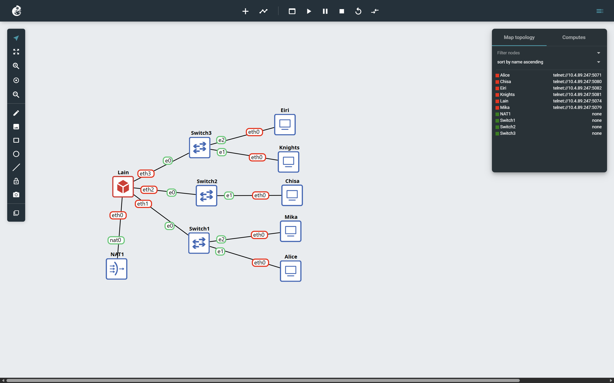

2. Setelah itu kita melakukan konfigurasi dari router nya hingga pada entitasnya menjadi client menggunakan prefix ip.

Konfig pada Router:
```sh
auto eth0
iface eth0 inet dhcp
  up sysctl -w net.ipv4.ip_forward=1    
  up iptables -t nat -A POSTROUTING -o eth0 -j MASQUERADE

auto eth1
iface eth1 inet static
    address 192.223.1.1
    netmask 255.255.255.0

auto eth2
iface eth2 inet static
    address 192.223.2.1
    netmask 255.255.255.0

auto eth3
iface eth3 inet static
  address 192.223.3.1
  netmask 255.255.255.0
```

Konfig pada masing-masing entitas:
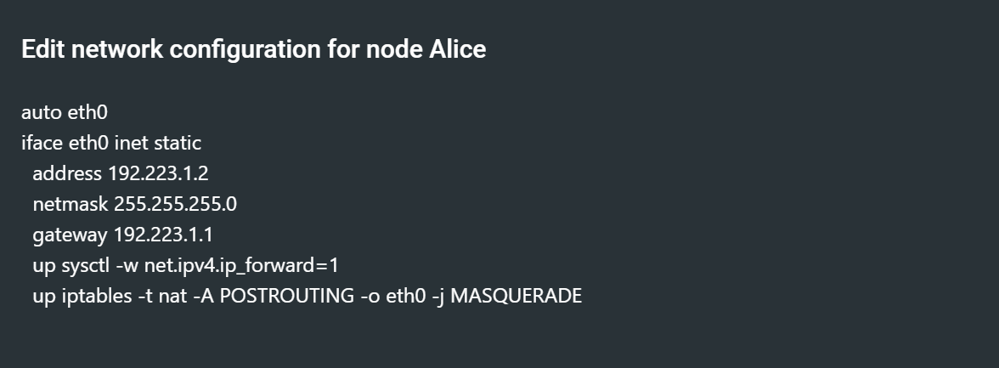

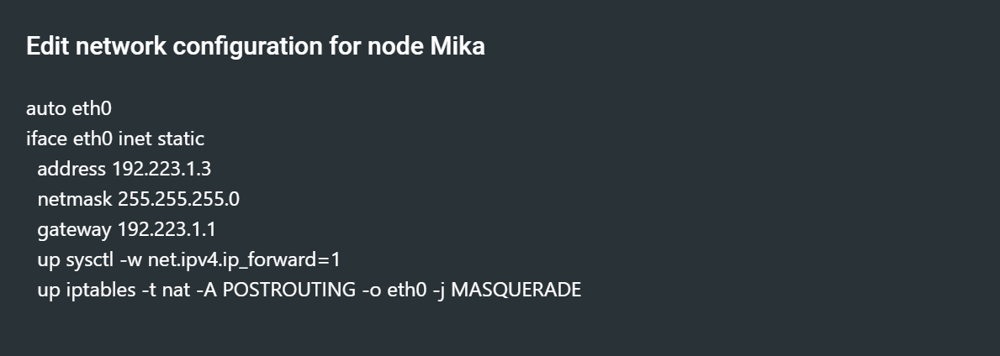

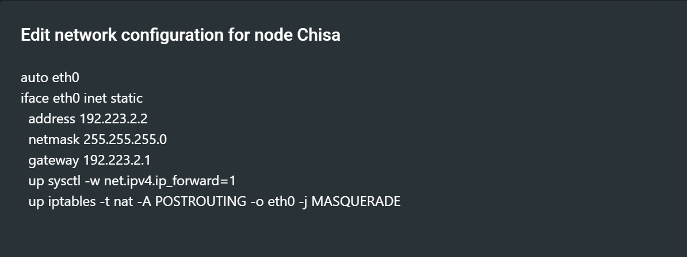

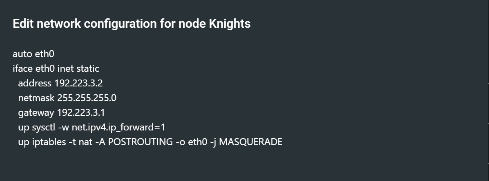

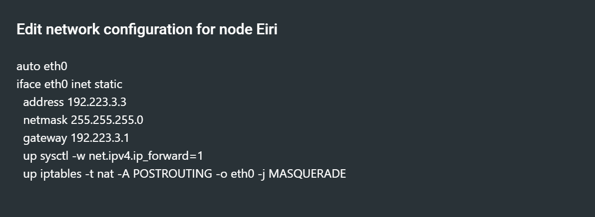

3. memastikan seluruh Entitas (Client) di bawah Switch 1, Switch 2, dan Switch 3 dapat saling terhubung dan berkomunikasi satu sama lain.


4. Setelah itu kita melakukan pengecekan bahwa setiap Client dapat terhubung ke internet secara mandiri dengan melakukan konfigurasi pada setiap Client

```sh
echo "nameserver 8.8.8.8" > /etc/resolv.conf
```

lalu kita cek apakah tersambung dengan penge cekan ke `google.com`:


5. Kita memastikan suluruh konfigurasi jaringan agar tidak hilang saat semua nya di node restart dengan membuat Buat script verifikasi di /root/cek_status.sh pada Router Lain.

```sh
ip -br a
echo" "
iptables -t nat -L -v -n  
```

Hasilnya:


6. Menjalankan file berikut (link file) lalu melakukan packet sniffing menggunakan Wireshark pada interface node mika, lalu menerapkan display filter khusus untuk enyaring paket yang berprotokol DNS atau ICMP.

Pertama - tama kita download file zip https://drive.google.com/drive/folders/1ZjFvWIjvAQAjE9pPthm7V_bGyaSt93lY?usp=sharing manual di google kemudian kita isi filenya dengan `nano traffic_protocol7.sh`

isi dari `traffic_protocol7.sh`:
```sh
#!/bin/bash
echo "============================================"
echo "  Protocol 7 Traffic Generator v2026"
echo "  Node: Mika Iwakura"
echo "============================================"
echo "[*] Generating DNS & ICMP traffic..."

# ICMP Traffic
ping -c 5 8.8.8.8 &
ping -c 5 1.1.1.1 &
ping -c 3 its.ac.id &

# DNS Queries
nslookup google.com 8.8.8.8 &
nslookup its.ac.id 8.8.8.8 &
nslookup github.com 1.1.1.1 &
dig @8.8.8.8 example.com A &
dig @1.1.1.1 cloudflare.com AAAA &

wait
echo "[*] Traffic generation complete."
echo "[*] Check Wireshark for captured packets."
```

kemudian kita menjalankan isi file tersebut dengan `bash traffic_protocol7.sh` selanjutnya kita click kanan pada kabel yang menghubungkan switch 1 dengan mika, lalu kita start capture.

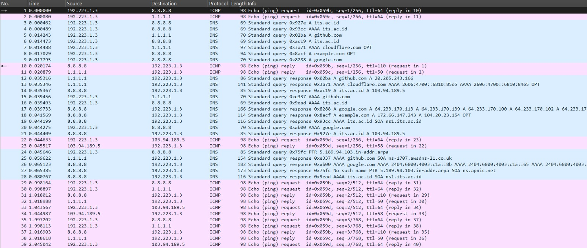

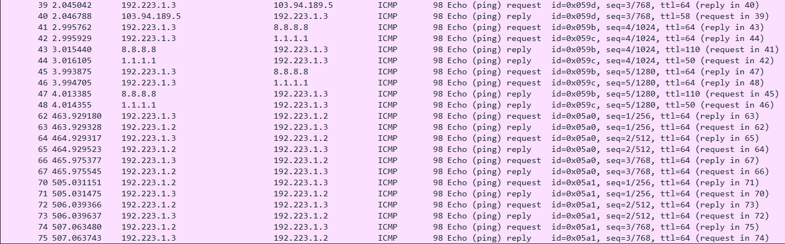

hasilnya si Mika minta request ke ip its.ac.id yaitu 103.94.189.5 kemudian Mika juga melakukan request ke ip address milik Alice. Mika melakukan request ke ip 8.8.8.8 dan ip 1.1.1.1

7. Chisa memutuskan mendirikan FTP Server pada node miliknya dengan shared folder di /var/wired/data. Terapkan kebijakan akses: user alice (hak akses read & write), user mika (dibatasi read-only), dan user eiri (dibatasi tanpa izin akses / blacklist). Buktikan konfigurasi dengan membuat file signal_alice.txt dari user alice, dan buktikan penolakan akses saat user eiri mencoba login.

disini kami melakukan set up ftp server dengan config sebagai berikut:

```sh
#!/bin/sh

# Atur DNS agar apk update bisa jalan
echo "nameserver 192.168.122.1" > /etc/resolv.conf

apk update
apk add vsftpd shadow

# Buat direktori shared
SHARED="/var/wired/data"
mkdir -p $SHARED
chmod 777 $SHARED

# Tambahkan nologin ke shells jika belum ada
grep -q "/sbin/nologin" /etc/shells || echo "/sbin/nologin" >> /etc/shells

# Buat user (Alice, Mika, Eiri)
id alice &>/dev/null || (useradd -d $SHARED -s /sbin/nologin alice && echo "alice:alice123" | chpasswd)
id mika &>/dev/null || (useradd -d $SHARED -s /sbin/nologin mika && echo "mika:mika123" | chpasswd)
id eiri &>/dev/null || (useradd -d $SHARED -s /sbin/nologin eiri && echo "eiri:eiri123" | chpasswd)

# Konfigurasi Utama vsftpd
cat <<EOF > /etc/vsftpd.conf
listen=YES
listen_address=0.0.0.0
anonymous_enable=NO
local_enable=YES
write_enable=YES
chroot_local_user=YES
allow_writeable_chroot=YES
seccomp_sandbox=NO
user_config_dir=/etc/vsftpd_users
EOF

# Konfigurasi Folder Berbasis User (Per-User Config)
mkdir -p /etc/vsftpd_users

# Hak akses penuh untuk Alice
cat <<EOF > /etc/vsftpd_users/alice
write_enable=YES
EOF

# Read-Only untuk Mika
cat <<EOF > /etc/vsftpd_users/mika
write_enable=NO
EOF

# Blacklist total untuk Eiri
cat <<EOF > /etc/vsftpd_users/eiri
write_enable=NO
download_enable=NO
dirlist_enable=NO
EOF

# Jalankan layanan vsftpd
pkill vsftpd
vsftpd /etc/vsftpd.conf &
```

kemudian kami menyimpan config file tersebut di file `ftp.sh` agar ketika nodenya direset config file tidak hilang dan juga mempermudah kami agar tidak set up ulang setiap kami reboot nodenya.

Kami login pada akun alice pada node Alice. Disini kami membuktikan bahwa akun alice memiliki akses untuk read & write dengan melakukan command `echo "hi ini alice" > signal_alice.txt`. Lakukan command `put signal_alice.txt` untuk mengirim file ke server ftp.
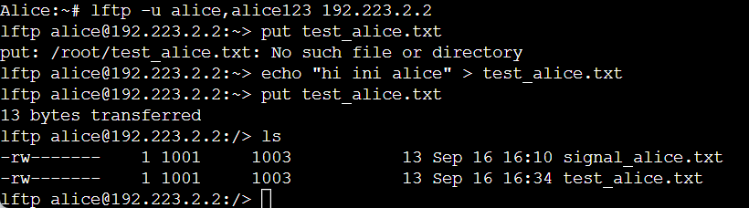

Selanjutnya kami login pada akun mika di node Mika untuk membuktikan akun mika hanya read-only. Kami menggunakan command `ls` dan `put test.txt` untuk membuktikan kalau akun mika hanya read-only. Pada gambar dibawah bisa dilihat kalau melakukan command `put` muncul tulisan "permission denied".
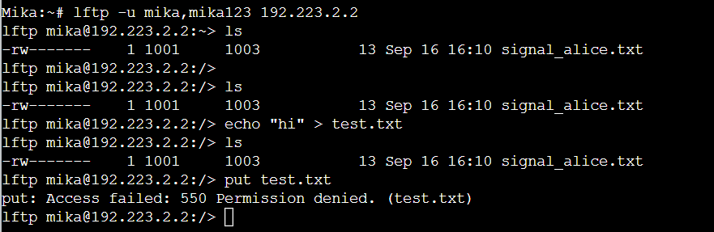

Selanjutnya kami login pada akun eiri di node Eiri untuk membuktikan kalau Eiri diblacklist dari server ftp. Kami menggunakan command `ls` dan `put tes_eiri.txt`. Bisa dilihat pada gambar dibawah ketika melakukan command tersebut maka muncul tulisan "permission denied"
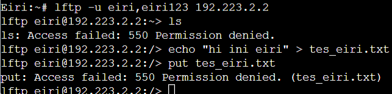

8. Kelompok rahasia Knights perlu mengirimkan dokumen laporan intelijen ke FTP Server Chisa. Lakukan koneksi FTP client dari node Knights ke FTP Server Chisa menggunakan akun alice. Upload file berikut (link file). Analisis sesi Wireshark dan sebutkan: perintah FTP untuk upload (STOR), kode status sukses server (226), dan port data TCP yang dinegosiasikan pada mode PASV.

Pertama kita pergi ke node Knights untuk login pake akun alice. kemudian kita menggunakan command
```sh
get https://drive.google.com/drive/folders/1tvZpueSH9E3GWwXM6KNnM64Y5wNoIAYP?usp=sharing
```
untuk meng-upload file dari google drive.


Kemudian kami mengecek di wireshark untuk setiap ip yang tercapture pada wireshark.


11. pertama kita melakukan setup di node chisa dengan membuat `setup_telnet.sh` yang isinya:

```sh
#!/bin/sh

echo "[*] Memperbarui repository dan menginstal busybox-extras (telnetd)..."
apk update
apk add busybox-extras

echo "[*] Membuat user 'phantom_user' dengan password 'wired_ghost'..."
adduser -h /home/phantom_user -s /bin/sh -D phantom_user
echo "phantom_user:wired_ghost" | chpasswd

killall telnetd 2>/dev/null
telnetd -l /bin/login

echo "[+] Setup selesai! Layanan Telnet aktif dan siap diuji dari node Eiri."
```

setelah itu kita beri izin dan menjalankannya:

```sh
chmod +x setup_telnet.sh
./setup_telnet.sh
```

Selesai setup kita lanjut ke node Eiri untuk melakukan telnet

```sh
telnet 192.223.2.2
```


setelah itu tangkap sesi itu menggunakan wireshark dan gunakan Tcp steam


Jelaskan Mengapa Setiap Karakter Terkirim dalam Paket TCP Terpisah
 **Jawaban:** 
  Setiap karakter dikirimkan dalam paket TCP yang terpisah karena protokol seperti Telnet menggunakan mode interaktif terminal berbasis karakter (*character-at-a-time*). Dalam mode ini, sistem tidak menunggu kalimat atau satu baris teks selesai diketik dalam *buffer*, melainkan langsung memproses dan mengirimkan setiap penekanan tombol (*keystroke*) seketika itu juga ke server agar karakter tersebut dapat langsung di-*echo* dan tampil secara *real-time* di layar pengguna tanpa adanya jeda atau *lag*.

12. Pertama kita ke node nya knights untuk melakukan setup menyambungkan port nya dengan membuat `setup_listener.sh` isinya:

```sh
#!/bin/sh

nohup sh -c "nc -lvkp 22 & nc -lvkp 80 &" > /tmp/port_test.out 2>&1 &

echo "setup selesai"
```

setelah itu kita beri izin dan menjalankannya:

```sh
chmod +x setup_telnet.sh
./setup_listener.sh
```

Selanjutnya kita ke node Alice untuk melakukan Netcat `nc` ke port 22, 80, dan port tertutup 7777.

```sh
nc -vz 192.223.3.2 22
nc -vz 192.223.3.2 80
nc -vz 192.223.3.2 7777
```

Setelah itu kita buka wireshark untuk menganalisisnya


## Analisis Perbedaan TCP Flag (Port Terbuka vs Port Tertutup)

### 1. Analisis Port Terbuka (Open Port)
* **Respons Server:** Ketika klien mengirimkan paket *SYN* ke port yang sedang aktif/terbuka (misalnya port layanan SSH di port `22` atau HTTP di port `80`), server merespons dengan mengembalikan kombinasi flag **SYN-ACK** (`0x0012`).
* **Kesimpulan:** Keberadaan flag *SYN-ACK* menandakan bahwa server siap menerima koneksi dan proses *3-way handshake* TCP dapat dilanjutkan.

### 2. Analisis Port Tertutup (Closed Port)
* **Respons Server:** Ketika klien mengirimkan paket *SYN* ke port yang tidak aktif atau tertutup (misalnya port uji coba pada port `7777`), server merespons secara langsung dengan mengembalikan flag **RST-ACK** (`0x0014`).
* **Kesimpulan:** Flag *Reset (RST)* yang dikombinasikan dengan *ACK* menunjukkan bahwa port tersebut tertutup dan menolak koneksi secara tegas, sehingga sesi komunikasi langsung dihentikan oleh sistem.

13. Pertama kita melakukan setup pada node knights untuk menginstall openssh server dengan `openssh.sh`

```sh
#!/bin/sh

apk update
apk add openssh

ssh-keygen -A

id mika_admin >/dev/null 2>&1 || adduser -h /home/mika_admin -s /bin/sh -D mika>
echo "mika_admin:secure_pass" | chpasswd

sed -i 's/#PasswordAuthentication yes/PasswordAuthentication no/' /etc/ssh/sshd>
sed -i 's/PasswordAuthentication yes/PasswordAuthentication no/' /etc/ssh/sshd_>
sed -i 's/#PubkeyAuthentication yes/PubkeyAuthentication yes/' /etc/ssh/sshd_co>

# Jalankan sshd langsung tanpa service manager
/usr/sbin/sshd

echo "[+] Setup SSH server di Alpine selesai dan aktif!"
```

Setelah melakukan setup kita lakukan pembersihan port dan SSH lama

```sh
killall nc
killall dropbear
killall sshd 
```

Jalankan OpenSSH di latar belakang
```sh
/usr/sbin/sshd
```

Selanjutnya kita ke node Mika untuk mengcopy public key dengan langkah dibawah ini:

```sh
ssh-keygen -R 192.223.3.2
```
Setelah itu kita kembali lagi ke node knights untuk menempel public key milik Mika

```sh
mkdir -p /home/mika_admin/.ssh

# Tempelkan kunci publik Mika di antara tanda kutip di bawah ini
echo "ssh-rsa AAAAB3NzaC1yc2EAAAADAQABAAABAQDGZbEAzkjFkbUG1/6Y7FCXWpiFKNSu+UjcbnFFpgsYV/5EHBcZz3sfICGS0D6xkWpIGUdU6imFHyWZ6y58FZbYk4EKS5LIxKvtMYjBdzqZ2AaIKSWSa49bniRxy1dvT9Ne3rgldXjhxguudjGbQEUuzJVbIJQAaMmpRqhc5DjUv7OH5tlbCboUVDWt5vPIdCy3S3Aa92dC/vPlLaDJ8fUJkANBvh/sHP0mh0i+E7dZ/SooRzW29tV/YRttZpNXtWhxW06/dPTfC2dC+zu26eNPMMk0gCf94qBW8/jsNAGyTofZuj38TQtqv44Lgs0RKgfpSO999ke9js5ozP82/yTJ root@Mika" > /home/mika_admin/.ssh/authorized_keys

chmod 700 /home/mika_admin/.ssh
chmod 600 /home/mika_admin/.ssh/authorized_keys
chown -R mika_admin:mika_admin /home/mika_admin/.ssh
```

Lalu kembali lagi ke node Mika untuk menjalankan koneksi SSH ke node knights

```sh
ssh mika_admin@192.223.3.2
```

dilanjutkan dengan menganalisis menggunakan wireshark


## Analisis Protokol SSH (Protocol Version Exchange, Key Exchange, & Enskripsi)

### 1. Identifikasi Paket Protocol Version Exchange
* **Analisis:** Berdasarkan hasil tangkapan paket, tahap awal komunikasi SSH dimulai dengan **Protocol Version Exchange**. Klien dan server saling bertukar string versi protokol yang digunakan secara terbuka (*plain text*) sebelum enkripsi aktif.
* **Contoh Paket:** Terlihat pada tangkapan paket, klien mengirimkan string versi dengan payload seperti `SSH-2.0-OpenSSH_10.2`.

### 2. Identifikasi Paket Key Exchange (KEX)
* **Analisis:** Setelah pertukaran versi, proses berlanjut ke **Key Exchange (KEX)**. Pada tahap ini, kedua belah pihak melakukan negosiasi algoritma kriptografi, metode pertukaran kunci (seperti `mlkem768x25519-sha256`), serta verifikasi identitas host menggunakan algoritma seperti `ssh-ed25519`. Paket ini berisi parameter negosiasi algoritma dan kunci publik sementara.

### 3. Penjelasan Mengapa Kredensial Tidak Terlihat dalam Bentuk Teks Terbuka
* **Analisis:** Berbeda dengan Telnet yang mengirimkan seluruh data dan kredensial secara mentah (*plain text*), SSH langsung mengaktifkan lapisan enkripsi yang kuat (seperti `chacha20-poly1305` atau AES) segera setelah proses *Key Exchange* selesai. Oleh karena itu, seluruh data interaktif berikutnya—termasuk *username*, *password*, atau perintah yang diketik—berubah menjadi *ciphertext* yang dienkripsi secara penuh, sehingga tidak dapat dibaca secara langsung di Wireshark.


14. disini kami menganalisis file wireshark dan soal yang ada pada socket server.

Untuk pertanyaan pertama **“What is the IP address of the attacker performing the brute force attack?”** kami melihat pada file wireshark ada 2 ip yang mencoba login ke host dengan IP dan port 172.26.7.100:8080 (yang juga menjawab pertanyaan kedua yaitu **“What is the target IP and port being attacked?”**).

Untuk IP 172.26.7.60 merupakan user Alice dan tidak ada tanda-tanda percobaan login berulang kali sehingga kami dapat memastikan dia bukan penyerang. Kemudian untuk IP 172.26.7.50 kami melihat adanya percobaan login paksa (brute force) sehingga kami memastikan bahwa IP tersebut adalah milik penyerang.

Untuk pertanyaan ketiga **“What is the password found for the user lain_admin?”** bisa kita lihat pada baris terakhir saat penyerang sukses login pada host 172.26.7.100:8080 (pada baris HTTP/1.1 200 OK) dengan melakukan follow stream dan melihat isi dari jaringan yang tercapture tersebut.

Dapat kita lihat kalau password dari user lain_admin adalah wired_pr0tocol_7 sekaligus menjawab pertanyaan keempat **“What is the web server software and version reported in the response header?”** yaitu Apache/2.4.62

15. disini kami menganalisis file wireshark dan soal yang ada pada socket server.

Untuk pertanyaan pertama **“What is the Vendor ID of the captured USB HID device?”** disini kami mencoba memahami dulu apa itu USB dan bagaimana prosesnya untuk mendapatkan descriptor. Pertama ketika USB dicolokkan ke komputer, komputer (host) akan mengirimkan sinyal reset buat jadi status awal alamat default (0). Kemudian sistem operasi bakal ngasih alamat unik ke USB-nya yang bakal jadi alamat sementara. Terus komputer ngasih perintah GET DESCRIPTOR ke USB di alamat barunya. Nah USB bakal nge-response dengan ngasih device descriptor yang berisi informasi krusial seperti idVendor (identitas produsen), idProduct (identitas model perangkat), dan versi USB yang didukung. Nantinya itu digunakan untuk memuat driver yang tepat di dalam sistem (kayak apakah perangkat yang dicolokkan adalah USB keyboard atau mass storage). Selanjutnya komputer minta descriptor lanjutan buat tahu berapa banyak daya yang dibutuhkan dan jalur komunikasi (endpoint) apa saja yang didukung perangkat. Terus sistem operasi menetapkan konfigurasi aktif, sehingga endpoint (misalnya Endpoint 1 untuk input data) terbuka. Setelah seluruh proses diatas selesai, maka komputer sepenuhnya tahu perangkat USB-nya (proses enumerasi selesai). Untuk jawaban dari pertanyaan pertama dapat kita lihat saat USB meresponse request dari host(komputer) di nomer 2.

Dapat dilihat pada device descriptor yang paling bawah akan terlihat idVendor-nya adalah 0x046d sekaligus menjawab pertanyaan kedua **“What is the Product ID of the captured USB HID device?”** yaitu 0xc31c.


Untuk pertanyaan ketiga **“What is the USB device address assigned to the keyboard?”** dapat kita lihat pada source 2.7.1 dan dilihat pada device address (bagian kiri bawah) itu adalah alamat sementara yang diberikan komputer buat USB-nya yaitu 7.


Untuk pertanyaan keempat **“What is the secret message decoded from the captured keystrokes?”** disini kami menerjemahkan leftover capture data yang ada pada source 2.7.1 dan merangkai setiap karakter yang diterjemahkan menjadi satu kalimat. Disini kami menggunakan tools yaitu kode pyhton agar mempermudah kami dalam menerjemahkan setiap karakter keystrokenya menjadi satu kalimat. Untuk jawabannya sendiri adalah “Wired_Protocol_7_is_alive_2026”.

berikut adalah tools yang kami gunakan dalam men-decode keystrokenya.

    import sys
    import re

    KEY_CODES = {
        0x04:['a', 'A'], 0x05:['b', 'B'], 0x06:['c', 'C'], 0x07:['d', 'D'], 0x08:['e', 'E'],
        0x09:['f', 'F'], 0x0A:['g', 'G'], 0x0B:['h', 'H'], 0x0C:['i', 'I'], 0x0D:['j', 'J'],
        0x0E:['k', 'K'], 0x0F:['l', 'L'], 0x10:['m', 'M'], 0x11:['n', 'N'], 0x12:['o', 'O'],
        0x13:['p', 'P'], 0x14:['q', 'Q'], 0x15:['r', 'R'], 0x16:['s', 'S'], 0x17:['t', 'T'],
        0x18:['u', 'U'], 0x19:['v', 'V'], 0x1A:['w', 'W'], 0x1B:['x', 'X'], 0x1C:['y', 'Y'],
        0x1D:['z', 'Z'], 0x1E:['1', '!'], 0x1F:['2', '@'], 0x20:['3', '#'], 0x21:['4', '$'],
        0x22:['5', '%'], 0x23:['6', '^'], 0x24:['7', '&'], 0x25:['8', '*'], 0x26:['9', '('],
        0x27:['0', ')'], 0x28:['\n','\n'], 0x2A:['[DEL]', '[DEL]'], 0x2C:[' ', ' '],
        0x2D:['-', '_'], 0x2E:['=', '+'], 0x2F:['[', '{'], 0x30:[']', '}'], 0x33:[';', ':'],
        0x34:['\'', '"'], 0x36:[',', '<'], 0x37:['.', '>'], 0x38:['/', '?']
    }

    def decode(file_path):
        with open(file_path, 'r') as f:
            content = f.read()

        # Otomatis mengekstrak data 8-byte HID dari dalam file berformat apapun (JSON/CSV/TXT)
        hex_data = re.findall(r'([0-9a-fA-F]{2}(?::[0-9a-fA-F]{2}){7})', content)
        if not hex_data:
            hex_data = re.findall(r'usb(?:hid)?\.(?:cap)?data["\':\s]*([0-9a-fA-F]{16})', content)
            
        text = ""
        for h in hex_data:
            line = h.replace(':', '')
            if len(line) < 16: continue
            
            shift = int(line[0:2], 16)
            is_shift = 1 if (shift == 0x02 or shift == 0x20) else 0
            
            keycode = int(line[4:6], 16)
            
            if keycode != 0 and keycode in KEY_CODES:
                char = KEY_CODES[keycode][is_shift]
                if char == '[DEL]':
                    text = text[:-1]
                else:
                    text += char
                    
        print(f"\n[+] Hasil Dekripsi:\n{text}\n")

    if __name__ == "__main__":
        if len(sys.argv) < 2:
            print("Penggunaan: python decode.py <nama_file_data>")
        else:
            decode(sys.argv[1])


Kemudian ini hasilnya


16. disini kami menganalisis file wireshark dan soal yang ada pada socket server

Untuk pertanyaan pertama **“What is the IP address of the FTP server used to download the malware?”** disini kami mengidentifikasi IP address yang tercapture di wireshark, yaitu ada IP 10.7.3.20 (USER alice), IP 10.7.3.30 (USER mika), IP 10.7.3.40 (USER guest), IP 10.7.3.50 (USER knights_agent), IP 10.7.3.60 (disini tertulis InternalFileServer), dan IP 198.51.100.7 (Server FTP). Lalu ketika USER knights_agent login pada server FTP, kami melihat tanda-tanda percobaan download suatu file malware “knights_payload.exe” yang ada pada server FTP. Kami menyimpulkan kalau IP 198.51.100.7 adalah server FTP dari hal diatas.


Untuk pertanyaan kedua **“What FTP server software banner is returned upon connection?”** dapat dillihat pada nomer 64 kemudian kami lakukan follow tcp stream, tulisan paling atas yang berada dalam tutup kurung adalah software bannernya yaitu “vsftpd 3.0.5” sekaligus menjawab pertanyaan ketiga **“What credential did the attacker use to log in to the FTP server?”** yaitu knights_agent:N4v1_s3cur3_2026 dan keempat **“What is the size in bytes of the malware file (knights_payload.exe) requested via FTP?”** yaitu 524228.


17. disini kami menganalisis file wireshark dan soal yang ada pada socket server

Untuk pertanyaan pertama **“What is the domain name (Host) where the suspicious files were downloaded from?”** ada pada nomer 30 ketika sebuah file navi_agent.exe didownload dengan command GET. Kami melakukan follow tcp stream untuk melihar siapa hostnya dan didapatkan hostnya adalah wired-update.net.


Untuk pertanyaan kedua **“What is the IP address of the web server hosting the malicious files?”** sudah tertera di nomer 30 kolom destination yaitu 203.0.113.42 sekaligus menjawab pertanyaan ketiga **“What is the filename of the executable malware payload downloaded by the client?”** yaitu navi_agent.exe dan pertanyaan keempat **“What is the HTTP status response code returned when downloading navi_agent.exe?”** yaitu 200.


18. disini kami menganalisis file wireshark dan soal yang ada pada socket server

Untuk pertanyaan pertama **“What network file sharing protocol was used to transfer the malware to the victim?”** disini kami melihat protocol dari source 10.7.3.100 dan destination pada IP 10.7.1.50 yang meminta request. Dari situ kami menyimpulkan kalau protocol yang digunakan adalah smb.


Untuk pertanyaan kedua **"What is the IP address of the source host delivering the malware?"** jawabannya adalah 10.7.3.100 (dapat dilihat pada gambar diatas) yang sekaligus menjawab pertanyaan ketiga **"What is the IP address of the victim host receiving the malware?"** yaitu 10.7.1.50, pertanyaan keempat **"What target share or directory on the victim was the malware written to?"** yaitu System32, dan pertanyaan kelima **"What is the filename of the executable malware transferred?"** yaitu wired_trojan_payload.exe.

19. disini kami menganalisis file wireshark dan soal yang ada pada socket server

Untuk pertanyaan pertama **"What is the email address of the victim targeted by the extortionist?"**

20. disini kami menganalisis file wireshark dan soal yang ada pada socket server